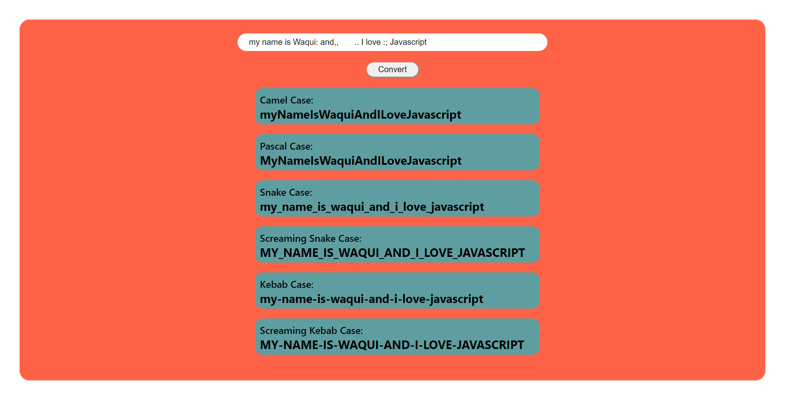

# NameConversion JavaScript_Project

> ### **Deployed Website** :-[Live Link](https://nameconversion-jsp.netlify.app/)
 

## Project key takeaways:

  - Used Only **JavaScript**, **Html** and **CSS** for this project.
  - used the split method to separate the words from the string.
  - Used map function to loop through the words. 
  - Used replace method along with RegEx to remove the character like numbers, . , : ; - _  and multiple spaces 
 - Used if else to target the last word and first letter of the words of the string.

   

 
